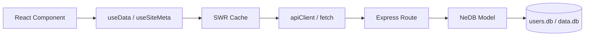
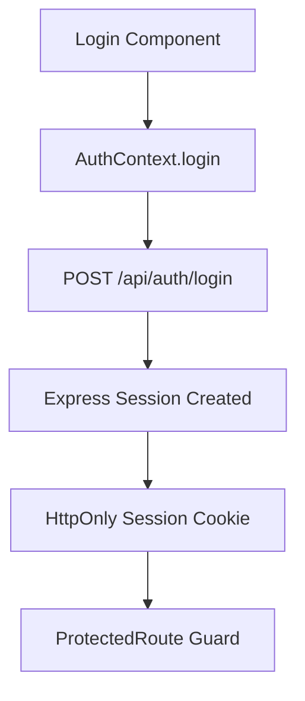
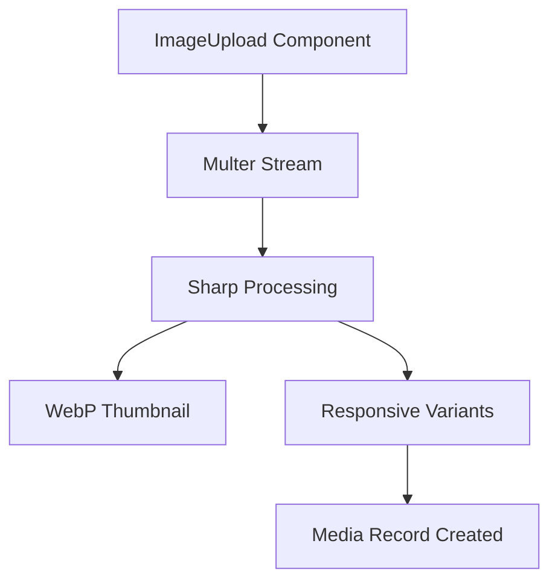

# System Architecture & Dependencies

This document provides a technical overview of the system's architecture, core data flows, and external dependencies.

---

## 🏗️ Architectural Overview

The application follows a standard **Client-Server** architecture with a focus on modularity and AI-assisted maintainability.

- **Frontend**: A modern React application built with Vite, leveraging SWR for data synchronization and vanilla CSS for a premium design system.
- **Backend**: A Node.js/Express server using NeDB for a lightweight, file-based persistence layer.

---

## 📦 Dependency Inventory

### Frontend (Client)
| Library | Purpose | Key Role |
| :--- | :--- | :--- |
| **React (v19)** | UI Framework | Core component model and state management. |
| **SWR** | Data Fetching | Handles caching, revalidation, and optimistic UI. |
| **React Router** | Routing | Manages application-level navigation and URL state. |
| **Lucide React** | Iconography | Provides a standardized set of premium SVG icons. |
| **Vitest** | Testing | Modern testing framework compatible with Vite. |
| **Storybook** | Component Explorer | Isolated development and documentation for UI components. |

### Backend (Server)
| Library | Purpose | Key Role |
| :--- | :--- | :--- |
| **Express** | Web Framework | Handles HTTP routing and middleware. |
| **NeDB Promises** | Persistence | Lightweight, disk-persistent datastore using MongoDB query syntax. |
| **BcryptJS** | Security | Handles secure password hashing and comparison. |
| **Sharp** | Image Processing | High-performance image conversion and thumbnail generation. |
| **Multer** | File Uploads | Middleware for handling `multipart/form-data` (file streams). |
| **Express Session** | Sessions | Manages user session state and authentication cookies. |

---

## 🛣️ API Route Registry

### Authentication (`/api/auth`)
| Method | Path | Auth Required | Description |
| :--- | :--- | :--- | :--- |
| GET | `/needs-setup` | None | Checks if an initial admin user exists. |
| POST | `/setup` | None | Initial setup: creates the first admin account. |
| POST | `/register` | None | Self-registration (requires admin approval). |
| POST | `/login` | None | Authenticates user and starts a session. |
| GET | `/me` | User | Retrieves the current session user's profile. |
| PUT | `/profile` | User | Updates current user's name/email. |
| POST | `/change-password` | User | Updates current user's password. |
| POST | `/logout` | User | Destroys the current session. |

### Users (`/api/users`)
| Method | Path | Role Required | Description |
| :--- | :--- | :--- | :--- |
| GET | `/` | Admin | Lists all registered users. |
| GET | `/pending-count` | Admin | Returns count of users awaiting approval. |
| PUT | `/:id` | Admin | Updates user role or basic details. |
| PUT | `/:id/approve` | Admin | Changes user status from `pending` to `active`. |
| PUT | `/:id/password` | Admin | Forced reset of any user's password. |
| DELETE | `/:id` | Admin | Removes a user account from the system. |

### Dynamic Data (`/api/data`)
| Method | Path | Role Required | Description |
| :--- | :--- | :--- | :--- |
| GET | `/types` | User | Lists all defined custom data types (schemas). |
| POST | `/types` | Admin/Editor | Creates a new custom data type. |
| GET | `/entities/:typeId` | User | Lists all records for a specific data type. |
| POST | `/entities/:typeId` | Admin/Editor | Creates a new record for a data type. |
| PUT | `/entities/:id` | Admin/Editor | Updates an existing data record. |
| DELETE | `/entities/:id` | Admin/Editor | Deletes a data record. |
| POST | `/entities/reorder` | Admin/Editor | Bulk-updates the order index for records. |

### Media & Uploads (`/api/upload`)
| Method | Path | Auth Required | Description |
| :--- | :--- | :--- | :--- |
| POST | `/` | User | Uploads one or more images (generates thumbs). |
| GET | `/` | User | Lists all stored media assets. |
| DELETE | `/:id` | User | Deletes a media asset and its physical files. |
| PUT | `/:id` | User | Updates media metadata (e.g., title). |
| POST | `/regenerate-thumbs`| Admin/Editor | Re-processes all images to match current config. |

---

## 🔄 Core Logic Flows

### 1. Data Fetching Pattern
The system uses **SWR** (Stale-While-Revalidate) for all data interactions.



### 2. Authentication Flow


### 3. Media Processing Pipeline


---

## 🛠️ Operational Utilities

### Emergency Admin Reset
If all admin accounts are inaccessible, use the CLI utility:
```bash
# Reset admin password and promote if necessary
node server/scripts/reset_admin.js <username> <new_password> --admin
```

### Data Seeding
To populate a fresh installation with base categories:
```bash
node server/scripts/seed_categories.js
```
